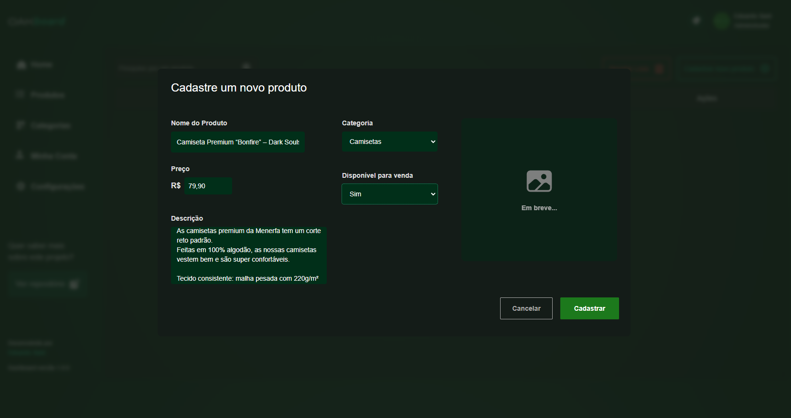

# Oakboard - Sistema de Cadastro e Listagem de Produtos

Bem-vindo ao Oakboard! Este é um projeto desenvolvido como parte de um teste técnico para uma vaga de estágio na OAK Tecnologia. projete a aplicação para que ela tivesse um bom desempenho, uma UI interessante e uma boa experiência no geral. Abaixo você encontrará detalhes sobre o projeto, como ele funciona e o que foi implementado.

---

## Funcionalidades Principais

### Cadastro de Produtos
- Formulário com os seguintes campos:
  - **Nome do produto**: Campo de texto.
  - **Descrição do produto**: Campo de texto.
  - **Valor do produto**: Campo numérico (valor monetário).
  - **Disponível para venda**: Opção com duas alternativas: "Sim" ou "Não".
- Modal de cadastro que:
  - Fecha automaticamente ao término do cadastro, exibindo a lista de produtos atualizada.
  - **Validações:**
    - Impede cadastro caso algum campo obrigatório não seja preenchido.
    - (Planejado) Exibição do dia e hora da última alteração ou cadastro realizado.
  - Ações desacopladas para que o cadastro funcione tanto com localStorage quanto com um banco de dados externo.



### Listagem de Produtos
- Exibe uma lista dos produtos cadastrados, com as seguintes colunas:
  - Nome do produto.
  - Preço do produto.
  - Categoria do produto.
  - Disponibilidade para venda.
  - Ações para o produto.
- Funcionalidades adicionais:
  - Ordenação automática do menor para o maior preço.
  - Pesquisa de produtos por nome:
    - Filtra os resultados dinamicamente.
    - Exibe uma mensagem personalizada caso nenhum resultado seja encontrado.
  - Mensagem "Lista vazia" caso não existam produtos cadastrados.
- (Concluído) Exclusão de produtos:
  - Remove o item da lista e atualiza a exibição.
- (Concluído) Edição de produtos:
  - Permite abrir o modal de cadastro com os campos pré-preenchidos para edição.

### Responsividade
- A interface é completamente responsiva, garantindo uma experiência de usuário fluida em dispositivos desktop, tablet e mobile.

### Navegação
- Implementação de tabs para navegação entre diferentes telas da aplicação.

---

## Implementações em andamento

- **Loading Animations:**
  - Animação para ações como "Cadastrando...", "Excluindo..".

- **Pré-configuração para Firebase:**
  - A aplicação está preparada para autenticação de sessão de usuário e futuras expansões, como painéis personalizados e CRUD atrelado ao usuário autenticado.

---

## Futuros Updates

- **Validação de ID:**
  - Geração automática de um ID fixo de 6 dígitos.
  - Prevenção de alterações manuais no campo do ID.
- **Modais de confirmação:**
  - Confirmação antes de excluir um item.
  - Notificação de sucesso ao concluir o cadastro.
  - Notificação de sucesso ao excluir o produto.
  - Notificação de sucesso ao atualizar o cadastro.
  - Confirmação ao tentar fechar o modal sem finalizar o cadastro.
- **Registro de data e hora:**
  - Exibição do momento da última alteração ou cadastro de cada produto.
- **Animações adicionais:**
  - Entrada e saída de modais, para uma transição mais fluida.
- **Paginação:**
  - Limitar a quantidade de itens na lista e adicionar visualização por páginas.
- **Notificações:**
  - Adicionar notificações ao deletar, adicionar ou excluir itens.
- **Autenticação com o Firebase:**
  - Em breve criarei um sistema de login e persistência de dados por usuário na aplicação usando o Firebase.  

---

## Como Executar o Projeto

1. Clone este repositório:
   ```bash
   git clone https://github.com/seu-usuario/oakboard.git
   ```
2. Acesse a pasta do projeto:
   ```bash
   cd oakboard
   ```
3. Instale as dependências:
   ```bash
   npm install
   ```
4. Execute o projeto:
   ```bash
   npm run dev
   ```
5. Abra o navegador e acesse:
   ```
   http://localhost:3000
   ```

---

## Tecnologias Utilizadas

- **Next.js**: Framework React para desenvolvimento web.
- **React**: Biblioteca para criação de interfaces de usuário.
- **Tailwind**: Para estilização.
- **LocalStorage**: Armazenamento local para persistência temporária dos dados.

---

---

## Contato

Em caso de dúvidas ou sugestões, entre em contato:
- **Nome:** Eduardo Santana
- **E-mail:** eduardo.santsouza@gmail.com
- **GitHub:** [edusantsouza](https://github.com/edusantsouza)
- **Linkedin:** [Eduardo Santana](https://www.linkedin.com/in/eduardo-sant-souza/)

---

## Licença

Este projeto está licenciado sob a [MIT License](https://opensource.org/licenses/MIT).

